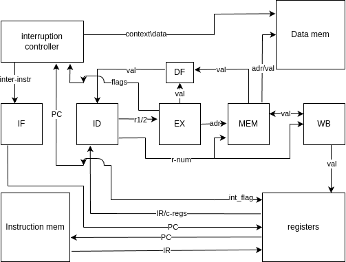
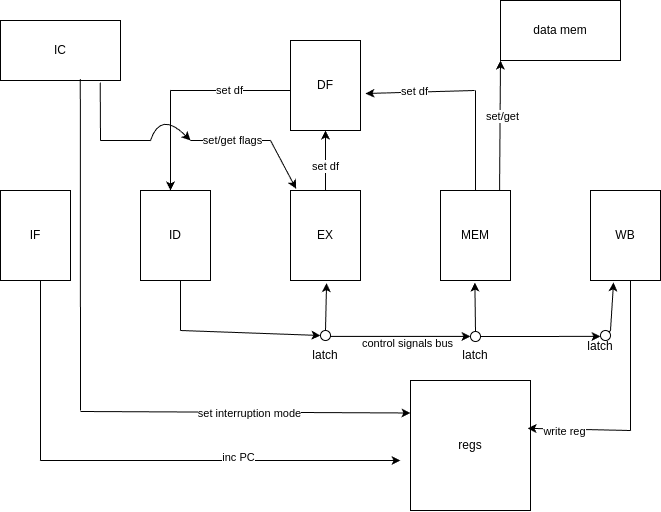

 # 4я лаба по ака
 ### Перминов Юра P3231

 ## Вариант
 asm | risc | harv | hw | tick | binary | trap | mem | pstr | prob2 | superscalar
 ## Язык программирования
 ### Описание в форме Бэкуса-Наура
    <program> ::= { <top-level-item> }

    <top-level-item> ::=
        <instruction>
      | <label-definition>
      | <macro-definition>
      | <directive>
    
    <label-definition> ::= <label-name> ":"
    
    <macro-definition> ::= "#define" <macro-name> "(" [ <macro-parameter-list> ] ")" "{" { <instruction> } "}"
    
    <macro-parameter-list> ::= <macro-parameter> [ "," <macro-parameter-list> ]
    
    <instruction> ::=
        <riscv-instruction>
      | <macro-call>
    
    <riscv-instruction> ::=
        "add"   <register> <register> <register>
      | "addi"  <register> <register> <immediate>
      | "lui"   <register> <immediate>
      | "lw"    <register> <immediate> "(" <register> ")"
      | "beqz"  <register> <label-name>
      | "jmp"   <label-name>
      | "halt"
      | ...
    
    <macro-call> ::= <macro-name> "(" [ <macro-argument-list> ] ")"
    
    <macro-argument-list> ::= <expression> [ "," <macro-argument-list> ]
    
    <expression> ::=
        <immediate>
      | <register>
      | <label-name>
    
    <register> ::= "t0" | "t1" | ... | "t31" | "zero" | ... 
    
    <immediate> ::= [+-]? <digit>+ | "0x" <hex-digit>+ | "0b" <bin-digit>+

    <byte>      ::=       <digit>+ | "0x" <hex-digit>+ | "0b" <bin-digit>+
    
    <label-name> ::= <letter> [ <letter> | <digit> ]*
    
    <directive> ::=
        ".word" <immediate>
      | ".byte" <byte>
      | ".buf" '/<byte>+'
      | ".text"
      | ".data"
    
    <expression-list> ::= <expression> [ "," <expression-list> ]

 ### Описание семантики
 #### Стратегия вычисления

 Все выражения ычисляются по вызову, те при вызове например 
 "add t0 t1 t2" значения регистров вычисляются до выполнения 
 комманды, результат записывается в целевой регистр или память, 
 команды переходов изменяют поток выполнения
 
 разбор примера
 
 при вызове читаются текущие значения t1 t2 и результат вычисления записывается в t0
 
 #### Область видимости

 - Метки - глобальная (каждая метка определяет адрес памяти данных / инструкций)

 - Регистры - глобальная
 
 - Макросы - глобальная

 #### Типизация
 
 статическая, все инструкции ожидают целые числа: номера регистров / целочисленное значение
 
 память данных представляет собой последовательность байтов
 
 память команд представляет собой последовательность 32 битных чисел
 
 целочисленные значения могут быть представлены в разных системах счисления: 0b0 / 0x0 / 10 / -10
 
 **пример семантики** "lw t4 4(t0)" значение t0 (пусть 100) + смещение (4). содержимое памяти по адресу 104 
  (32 бита) записывается в t4
 
 ## Организация памяти

 есть два адресных пространства - память данных и память инструкций, разделенных *физически*

 память данных - последовательность байтов (можно прочитать, как машинное слово, в памяти оно хранится в little endian)
 , память инструкций - последовательность машинных слов 

 размер машинного слова - 32 бита (знаковое число в случае арифметических операция, беззнаковое в случае bitwise операций)

 для памяти данных есть адресация со смещением (например lw t4 4(t1), адрес в t1, смещение в immediate)
 
 в памяти инструкций есть относительная адресация (используется в jmp / beqz итп) и абсолютная (PC хранит абсолютный адрес, LJMP принимает абсолютный адрес)

 процессор может получить доступ к памяти через регистры общего назначения, при помощи инструкций чтения / записи, к памяти инструкций происходит доступ через регистр IR

 стэк размещен в конце памяти данных и растет к ее началу

 все инструкции хранятся в памяти инструкций, данные (из .data секции / стэк / записанные во время работы процессора) в памяти данных

 информация о прерывании хранится на стэке, для обработки прерывания (контроллером) выделен отдельный регистр IC (interruption context)

 immediate значения (в контексте addi t0 t0 1) закодированы непосредственно в инструкции, все остальные - в памяти данных

 есть регистры общего назначения, доступные программисту напрямую t0-t31 и спец. регистры IR - регистр для инструкции PC 
 - счетчик команд PS - состояние процессора (работает / не работает), косвенно програмист имеет доступ к PC (jmp/ljmp) к PS (halt)

 также есть отдельная read-only память для контроллера прерываний, в ней хранятся инструкции для вызова прерывания (тк для вызова
 прерывания требуется несколько инструкций), во время прерывания инструкции записываются в IR 

 Программисту доступны:

 - регистры общего назначения (t0 - t31, t31 - SP), косвенно t32 - PC (через команды ветвления)
 - Память данных (через регистры общего назначения)
 - память инструкций (read-only)

    
       регистры               память данных                  память инструкций
    +-------------+  +---------------------------------+ +-----------------------+
    |  t0-t31     |  | 0x00000000 - байт               | | 0x0.0 addi t0 t0 0    |
    +-------------+  | 0x0.0 - 0x0.4 - машинное слово  | | 0x0.1 0xFE0a0123      |
                     | 0x0.0 - 0x0.n - буфер / строка  | | 0x0.n halt            |  
                     +---------------------------------+ +-----------------------+

 при инструкции чтения будет загружено машинное слово (в памяти оно хранится в формате little endian)
 
 доступно чтение одного байта, в обоих случаях адрес считается от 0 в байтах
 
 по такой же схеме работает запись
 
 есть возможность загрузки со смещением, те к адресу в регистре добавляется целое число
 
 при сохранении двух машинных слов по памяти 0x1 и 0x2 (пусть слова будут 0xAABBCCDD и 0xEEFF1122) в памяти будет DD2211FFEE, 
 тк адресация происходит в байтах, и машинные слова хранятся в little endian
 
 при загрузке бинарного файла в память записываются *кластеры* памяти из .data секции, например в .data лежит:
 
        .data
    .org 0x16
    a: .word 0x88FF
    b: .byte 0xEE
    .org 0x35
    buffer: .buf '/00/FF/EE'

 тогда в память будет загруженно:

    ...
    0x00000016: 0xFF
    0x00000017: 0x88
    0x00000018: 0x00
    0x00000019: 0x00
    0x00000020: 0xEE
    ...
    0x00000035: 0x00
    0x00000036: 0xFF
    0x00000037: 0xEE
    ...

 при push регистр будет размещен в конец памяти, пусть размер памяти - 0x0000FFFF, а значение регистра - 0xAABBCCDD тогда:
 
    ...
    0x0000FFFC: 0xDD
    0x0000FFFD: 0xCC
    0x0000FFFE: 0xBB
    0x0000FFFF: 0xAA

 при pop просто сдвигается SP
 
 ## Система команд
 каждая команда кодируется 32 битным машинным словом, при этом есть 5 типов комманд (у некоторых формат одинаковый, но легче ориентироваться и декодировать)
 
 тк у risc процессоров нету микрокоманд, то все управляющие сигналы высчитываются из funct в самих командах

 немного забегая вперед: в моем эмуляторе реализован 5 стадийный pipeline, где одновременно выполняются 5 команд, и для каждой стадии просчитываются сигналы из инструкции, например

 ADD t1 t3 t5
 **0b00000000_00101_00011_00001_000001_000**, тут 000001 - функциональные биты, для всех команд нулевого типа
 *по умолчанию* устанавливаются сигналы на запись значения регистра (WB) и алу (EX) и функциональные биты тут представляют (см ниже)

 

 типы команд:
 
    3 bits - command number
    | 31 | 30 | 29 | 28 | 27 | 26 | 25 | 24 | 23 | 22 | 21 | 20 | 19 | 18 | 17 | 16 | 15 | 14 | 13 | 12 | 11 | 10 |  9 |  8 |  7 |  6 |  5 |  4 |  3 |  2 |  1 |  0 |
    | +- |                       imm        |           s2           |           r1           |           rd           |    funct2    |     funct1   |       cn     | 1st type
    | +- |                                                      imm                 |           r            |           rd           |     funct    |       cn     | 2nd type
    | +- |                                                      imm                                          |           rd           |     funct    |       cn     | 3nd type
    | +- |                                                      imm                                          |           rd           |     funct    |       cn     | 4d  type
    | +- |                                                      imm                                          |           rd           |     funct    |       cn     | spec

 тут imm - целочисленное знаковое значение, +- его знак, funct - функциональные биты (от которых вычисляются сигналы процессора)
 r* - номера регистров, cn - номера команд
 
 описание команд и их декодирования:
 
    1 type 0b00
    ADD SUB AND OR XOR ADDI SHL SHR ROL ROR MUL DIV REM
    funct1: 1st bit - sum or bitwise or\and
            2nd bit - 2nd operand - negative/(if sum = 0 => or|and)
            3d  bit - addi (if 1st bit is 1), xor (if first bit is 0)
    funct2: 1st bit - need shift or not
            2nd bit - shift left\right
            3d  bit - cyclic shift
    combined funct:
            1st bit of funct 1 and 1st bit of funct 2 - need multiplication or division or remainder
            funct1 snd bit - multiplication
            funct1 thd bit - division
            funct 1 snd and thd bit - remainder
            in this case funct2 snd and thd bit - are reserved
    here s1 - first register, s2 - second register, rd - destination register, imm only used in addi
    2 type 0b01
    LW SW SB                                lower\upper
    funct: 1st bit - load\store
           2nd bit - SB
           3d  bit - add displacement
    rd - destination register (where data will be writen\readen)
    r - address register
    
    3 type 0b10
    LI
    funct: 1st bit - LI
           2nd bit -
           3d  bit - upper\lower
    4 type 0b11
    BEQZ BEQN BNEZ BNEN JMP LJMP
    funct: 1st bit - (JMP or branch instruction) (if 1 => JMP)
           2/3 bit - (00 - BEQZ, 01 - BEQN, 10 - BNEZ, 11 - BNEN) if first bit is 1 - 2nd bit defines JMP or long JMP(LJMP)
    register is comparing value, immediate is a displacement
    if its a jump, immediate value is displacement
    if its long jump, register is an address
    
    spec 0b100
    HALT NOP
    register is a register with address
    funct: 1st bit - is interruption
           2nd bit - is return (is interruption is zero, this bit defines call\ret, else int\iret)
           3d  bit - halt
           if all zeros => NOP

 также есть *длинные* команды, выполнение которых невозможно за один такт, например int\iret, при компиляции они *разварачиваются* в 
 
    # INT
    # SET_INT_FLAG 1    ; setting interruption mode
    # PUSH PC           ; saving program counter
    # NZVC->IC          ; getting nzvc flags
    # PUSH IC           ; saving nzvc flags
    # LW IC 0(int_num)  ; getting interruption handler address
    # LJMP 0(IC)        ; jumping into it
    
    # IRET
    # LW IC 0(SP)       ; loading nzvc flags
    # IC->NZVC          ; restoring nzvc flags
    # POP               ; popping nzvc flags
    # LW IC 0(SP)       ; loading PC
    # POP               ; popping PC
    # SET_INT_FLAG 0    ; quiting interruption
    # LJMP 0(IC)        ; returning back

 подробности установки сигналов и последовательности исполнения команд см в [конфиге эмулятора](https://github.com/tinunadno/csa_4th_lab/blob/actual_risc_arcitecture/src/configurations/internal_emulator_config.yaml)
 
 более подробно про исполнение инструкций в пункте "Модель процессора"
 
 ## Компилятор

 ### Интерфейс

 Входные данные: имя файла .asm с текстом программы
 
 Выходные данные: бинарный файл в формате
 
    +-----------------------++----------------++--------------++-----------------++------+   +--------------+
    | entry points (_start) || clusters count || cluster size || cluster address || data |...| text section |
    +-----------------------++----------------++--------------++-----------------++------+   +--------------+
          32 bits                 32 bits           32 bits         32 bits        bytes       32 bit words

 тут ebtry point - точка входа в программу, clusers count - количество *чанков памяти* из .data. сcluster size - размер
 чанка (в байтах), cluster address - адрес чанка, data - данные чанка. text section - скомпилированные инструкции
 
 так же транслятор выводит код после препроцессора, чанки памяти, адреса меток, пример:
 
      _start label: {'address': 0, 'section': 'text'} |                   |                                    
      preprocessed_code                               |                   |                                    
      addi t3 t4 0                                    |                   |                                    
      bnez 1                                          |                   |                                    
      jmp -3                                          |                   |                                    
      addi t3 t0 0                                    |                   |                                    
      beqz 7                                          |                   |                                    
      xor t3 t3 t3                                    |                   | other labels:                      
      addi t3 t0 0                                    |                   | _start                             
      add t2 t2 t3                                    | MEMORY CHUNKS     | 	{'address': 0, 'section': 'text'} 
      mul t3 t3 t3                                    | 0x00000016 | 0x12 | read_loop                          
      add t1 t3 t1                                    | 0x00000017 | 0x00 | 	{'address': 0, 'section': 'text'} 
      addi t0 t0 -1                                   | 0x00000018 | 0x00 | loop                               
      jmp -9                                          | 0x00000019 | 0x00 | 	{'address': 3, 'section': 'text'} 
      mul t2 t2 t2                                    | ...               | end_loop                           
      sub t3 t2 t1                                    |                   | 	{'address': 12, 'section': 'text'}
      lui t2 0x84                                     |                   | int16                              
      lli t2 0x84                                     |                   | 	{'address': 18, 'section': 'text'}
      sw 0(t2) t3                                     |                   |                                    
      halt                                            |                   |                                    
      lui t0 0x80                                     |                   |                                    
      lli t0 0x80                                     |                   |                                    
      lw t0 0(t0)                                     |                   |                                    
      addi t4 t4 1                                    |                   |                                    
      iret                                            |                   |

 запуск компилятора:
 ``` bash
  python main.py path_to/source.asm
 ```
 после этого в path_to появится исполняемый файл exec
 
 ### Компиляция
 
 компиляция происходит в три этапа: препроцессинг (максросов) -> препроцессинг (меток) -> транслиция в машинный код
 
 #### препроцессинг макросов происходит по следующиму сценарию
 
 нахождение максросов (#include / #define)
  
 если #include то по относительному (относительно source.asm) код из указанного файла вставляется в код source.asm
 
 если #define то сохраняются его имя, значение / аргументы, тело
 
 потом происходит подстановка define'ов, аргументы вставляются вместо указанных в #define (в тело define'а), тело из вызова
 вставляется в тело дефайна на место ключегого слова body
 обработанный define вставляется в место вызова. Если это define вида #define C 0x10 то просто вставляется значение
 
 #### препроцессинг меток
 ищутся метки, сохраяняются их имена и адреса (!адреса разные для меток в .text и в .data) в случае .data меток подставляются их 
 адреса, в случае .text - смещение относительно места вызова
 
 #### трансляция команд
 трансляция происходит по правилам, описанным в
 [конфиге эмулятора](https://github.com/tinunadno/csa_4th_lab/blob/actual_risc_arcitecture/src/configurations/internal_emulator_config.yaml)
 
 пример: ADDI t0 t0 1
 
 - ищется описание мнемоники
 - ищется описание типа
 - в соответствиями с правилами подстановки операндов собирается команда

    
      - command_number: 0
        description: "arithmetic operations"
        bit_layout:
          cn:
            bits: [ 0, 2 ]
            description: "Command number"
          funct:
            bits: [ 3, 8 ]
            description: "functional bits 1"
          rd:
            bits: [ 9, 13 ]
            description: "register destination"
          r1:
            bits: [ 14, 18 ]
            description: "first operand register number"
          r2:
            bits: [ 19, 23 ]
            description: "second operand register number"
          imm:
            bits: [ 24, 31 ]
            description: "immediate value"
    ...
      - mnemonic: "ADD"
      args:
        - [ "t$", "$%rd" ]
        - [ "t$", "$%r1" ]
        - [ "t$", "$%r2" ]
      type: 0
      functional_bits_match: [ 0, 0, 0, 0, 0, 1 ]
      signals:
        - name: "EX_signal"
          args: [ "r1%reg1", "r2%reg2", "add" ]
        - name: "WB_signal"
          args: [ "$rd%reg_dest", "need_wb" ]

 ADD t0 t0 t0 разбивается на мнемонику и токены -> "ADD" ~ "t0" "t0" "t0", затем исходя из правил подстановки
 
    - [ "t$", "$%rd" ]
    - [ "t$", "$%r1" ]
    - [ "t$", "$%r2" ]

 вычисляются значения токенов 
 
 - t0 -> t$ -> 0

 и исходя из правил подстановки и формата команды собирается инструкция
 
 - 0 -> $%rd -> rd (в описании типа rd - [9-13] биты, так что 0 подставляется туда)

 также опираясь на описание типа происходит подстановка функциональных битов и номера команды
 
 ## Модель процессора

 ### Консольный интерфейс

 Входные данные: путь к бинарному файлу, сгенерированному компилятором, путь к конфигу .yaml, где описаны io, логи, ассерты
 
 [пример конфига](https://github.com/tinunadno/csa_4th_lab/blob/actual_risc_arcitecture/tests/golden_tests/test_cases/log_test/log_test.yaml)
 
 #### Правила конфига

 в корне **limit** - ограничение по тактам, **mem_size** - размер памяти данных (если меньше, чем размер нужный бин файлу / memmapped портам, будет взят больший)
 
     io_mem_map - раздел маппинга портов
       int_vec - номер вектора прерывания
       input
         port - адрес ячейки
         interruptions - прерывания в формате [[<такт>, <значение>]+]

 log_fmt - формат логов, only_start - в начале работы процессора, each_tick - на каждом такте
 доступны логи памяти, регистров, декомпилированной памяти инструкций, номер такта, режим прерывания

 также доступна визуализация мнемоник в стадиях пайплайна

 формат логов описывается во view, в строке последовательно указываются блоки логов, с разделителями (| разделит горизонтально через |)

 assertion - формат асертов,
 требуется указать вид проверяемого юнита, slice - какие данные, expected - ожидаемые данные

 например 

        assertion:
            -name: "mem"
             byte:          # в байтах
             slice: [0, 31] # проверить адреса с 0 до 31
             expected: [0...]
                или
             expected: "testtest"

 также доступен режим дебага, для этого в log_fmt нужно указать ключ debug, пример
 
    
    TICK:  52
    IS INTERRUPTION: True
     PIPELINE STATE:
    [WB] Started write back stage                                                                                                                          |                                |                               
    [WB] Don't need WB                                                                                                                                     |                                |                               
    [MEM] Starting memory stage processing                                                                                                                 |                                |                               
    [MEM] Memory access not needed, skipping                                                                                                               |                                |                               
    [EX] Starting execution with signals: {'reg1': 0, 'reg2': 0, 'add': 0, 'addc': 0, 'and': 0, 'neg_second': 0, 'xor': 0, 'need_shift': 0, 'sh_dir': 0, ' |                                |                               
    cycl': 0, 'discard_nzvc': 0, 'comp': 0, 'comp_num': 0, 'mul': 0, 'div': 0, 'rem': 0, 'get_nzvc': 0, 'set_nzvc': 0, 'FORCE_DISCARD_FORWARDING': 0, 'FOR |                                |                               
    CE_ENABLE_FORWARDING': 0}                                                                                                                              | MEMORY:                        | INSTRUCTION MEMORY:           
    [EX] Operation completed. Result: 0, Flags: {'N': False, 'Z': False, 'V': False, 'C': 0}                                                               | ADDRESS    | DATA              | ADDRESS    | INSTRUCTION      
    [ID] Started instruction decode stage                                                                                                                  | 0x00000000 | 0x00              | 0x00000000 | 0x0000086A       
    [ID] Processing command: 16235552                                                                                                                      | 0x00000001 | 0x00              | 0x00000001 | 0x000401AA       
    [ID] Command type: 0, functional bits: 4                                                                                                               | 0x00000002 | 0x00              | 0x00000002 | 0x0000D1EA       
    [ID] Checking data forwarding signals                                                                                                                  | 0x00000003 | 0x00              | 0x00000003 | 0x0018C620       
    [ID] Matched command description: {'mnemonic': 'XOR', 'args': [['t$', '$%rd'], ['t$', '$%r1'], ['t$', '$%r2']], 'type': 0, 'functional_bits_match': [0 | 0x00000004 | 0x00              | 0x00000004 | 0x00004628       
    , 0, 0, 1, 0, 0], 'signals': [{'name': 'EX_signal', 'args': ['r1%reg1', 'r2%reg2', 'xor']}, {'name': 'WB_signal', 'args': ['$rd%reg_dest', 'need_wb']} | 0x00000005 | 0x00              | 0x00000005 | 0x0000080B       
    ]}                                                                                                                                                     | 0x00000006 | 0x00              | 0x00000006 | 0x80002003       
    [ID] Setting pipeline signals                                                                                                                          | 0x00000007 | 0x00              | 0x00000007 | 0x0000000A       
    f[ID] Got forward 512 for reg[30]                                                                                                                      | 0x00000008 | 0x00              | 0x00000008 | 0x0000D02A       
    [ID] Got register r1 value: 5                                                                                                                          | 0x00000009 | 0x00              | 0x00000009 | 0x00000021       
    [ID] Set signal EX_signal.reg1 = 5                                                                                                                     | 0x0000000A | 0x00              | 0x0000000A | 0x0004206A       
    f[ID] Got forward 512 for reg[30]                                                                                                                      | 0x0000000B | 0x00              | 0x0000000B | 0x00000628       
    [ID] Got register r2 value: 5                                                                                                                          | 0x0000000C | 0x00              | 0x0000000C | 0x0000F2AA       
    [ID] Set signal EX_signal.reg2 = 5                                                                                                                     | 0x0000000D | 0x00              | 0x0000000D | 0x003FFBCA       
    [ID] Set signal EX_signal.xor = 1                                                                                                                      | 0x0000000E | 0x00              | 0x0000000E | 0x0000246A       
    [ID] Set signal WB_signal.reg_dest = 30                                                                                                                | 0x0000000F | 0x00              | 0x0000000F | 0x00210820       
    [ID] Set signal WB_signal.need_wb = 1                                                                                                                  |                                |                               
    [ID] Finished instruction decode stage                                                                                                                 |                                |                               
    [IF] Started instruction fetch stage                                                                                                                   |                                |                               
    [IF] inserting an interruption instruction: 490536                                                                                                     |                                |                               
    [IF] Fetched instruction, IR = 0x77c28 | 0b1110111110000101000, didn't touch PC                                                                        |                                |                               
    [IF] left interruption instructions: [1922, 1972, 1922, 16235552, 47018, 63393, 1939]                                                                  |                                |                               
    
    PIPELINE_STAGES_MNEMONICS:
    {[IF]: 'ADDI t30 t29 0'}->{[ID]: 'XOR t30 t30 t30'}->{[EX]: 'SET_INT 1'}->{[MEM]: 'NOP'}->{[WB]: 'NOP'}
    REGISTERS:
    t0          t1          t2          t3          t4          t5          t6          t7          t8          t9          t10         t11         t12         t13         t14         t15         
    0x00000000  0x00000007  0x00000000  0x00000001  0x00000001  0x00000000  0x00000080  0x0000001E  0x00000000  0x00000000  0x00000000  0x00000000  0x00000000  0x00000000  0x00000000  0x00000000  
    t16         t17         t18         t19         t20         t21         t22         t23         t24         t25         t26         t27         t28         t29 (PC)    t30 (IC)    t31 (SP)    
    0x00000000  0x00000000  0x00000000  0x00000000  0x00000000  0x00000000  0x00000000  0x00000000  0x00000000  0x00000000  0x00000000  0x00000000  0x00000000  0x00000006  0x00000005  0x00000200  
    t32         t33 (IR)    t34 (PS)    t35         
    0x00000000  0x00077C28  0x00000000  0x00000000  

в нем выводится состояние регистров, памяти, памяти инструкций и логи для каждой из стадий, так же он поддерживает комманды

    tick ~ perform pipeline tick       
    mem_slice ~ show memory slice       
    inst_slice ~ show instruction memory slice       
    dec_slice ~ show instruction memory slice but decompiled       
    help ~ show available commands_descriptions       
    break ~ set break point       
    show_bp ~ show break points       
    run ~ perform ticks until end or break points   

в режиме дебага можно потактово наблюдать за состоянием процессора, ставить брейк поинты итп


 ### Схема

 #### DataPath

 
 
 где:
  - IF - instruction fetch controller
  - ID - instruction decoder controller
  - EX - execution controller (ALU)
  - MEM - data memory controller
  - WB - write back controller
  - DF - data forwarding controller
  - Data memory - однопортовая память
  - PC - program counter
  - IR - instruction register
  - inter-instr - инструкции прерывания (!!!не обработки, а вызова: сохранение контекста, переход)
  - flags - флаги АЛУ
  - r-num - номер регистра
  - c-regs - common registers
  - val - машинное слово
  - addr - адрес в пространстве Data mem
  - context - контекст прерывания
  - флаги я не рисовал, что бы не заграмождать схему, они хранятся в спец регистрах

 #### Control Unit

 
 
 тут стоить уточнить latch на control signals bus - они защелкивают контролирующие сигналы
 для соответствующего юнита до следующего такта, тк на текущем там еще исполняется предыдущая инструкция
 
 тк это 5 стадийный пайплайн исполнение комманд можно изобразить так:
 
    +-------+--------+--------+--------+--------+--------+
    | TICK  |   IF   |   ID   |   EX   |   MEM  |   WB   |
    +-------+--------+--------+--------+--------+--------+
    |   1   |   ADD  |   NOP  |   NOP  |   NOP  |   NOP  | # тут инструкция помещается в IR
    +-------+--------+--------+--------+--------+--------+
    |   2   |  HALT  |   ADD  |   NOP  |   NOP  |   NOP  | # тут происходит декодирование (при этом помещение новой и-ии в IR) 
    +-------+--------+--------+--------+--------+--------+
    |   3   |   NOP  |  HALT  |   ADD  |   NOP  |   NOP  | # исполнение  
    +-------+--------+--------+--------+--------+--------+
    |   4   |   NOP  |   NOP  |  HALT  |   ADD  |   NOP  | # обращение к памяти (в данном случае не нужно) 
    +-------+--------+--------+--------+--------+--------+
    |   5   |   NOP  |   NOP  |   NOP  |  HALT  |   ADD  | # запись результата в регистр  
    +-------+--------+--------+--------+--------+--------+
    |   6   |   NOP  |   NOP  |   NOP  |   NOP  |  HALT  | # остановка работы 
    +-------+--------+--------+--------+--------+--------+

 более подробное описание контролирующих сигналов см в [конфигурации эмулятора](https://github.com/tinunadno/csa_4th_lab/blob/actual_risc_arcitecture/src/configurations/internal_emulator_config.yaml)
 

 #### Особенности

 тк одновременно исполняются 5 инструкций могут возникнуть проблемы (data hazard'ы):
 
 - Structural Hazard тк EX идет сразу за MEM то может возникнуть ситуация, когда в
регистр было прочитано значение, а сразу после в EX над ним производится операция, такая проблема решается
внесением bubble или же NOP после операции чтения. Так же может возникнуть такая ситуация:
    

      ADDI t0 t0 1
      ADD t2 t1 t3    ; на момент исполнения предыдущая команда еше на MEM стадии

Но тк понять, когда именно вносить bubble тяжело, а вносить его дорого, был придуман DataForwarding, это 
когда MEM/EX стадия передает значение регистра напрямую в декодер, не дожидаясь WB

 - Control Hazard бранчи (jmp/beqz...) могут вызывать проблемы, что пока jmp дойдет до WB уже будет исполнено 3 инструкции
что не хорошо. В крутых risc процессорах это разрешается предсказанием потока исполнение, у меня внесением пузырей

так же есть еще несколько типов Hazard'ов, но по сути все они контрятся DF'ами и bubble'ми

 ## Тестирование

 были разработаны интеграционнаые тесты в формате [golden тестов](https://github.com/tinunadno/csa_4th_lab/tree/actual_risc_arcitecture/tests/golden_tests)
  и [юнит тестов](https://github.com/tinunadno/csa_4th_lab/tree/actual_risc_arcitecture/tests/compiler_unit_tests) (юнит тестов не так много, мне быстро надоело)
 
 ### golden test'ы

 #### [euler2](https://github.com/tinunadno/csa_4th_lab/tree/actual_risc_arcitecture/tests/golden_tests/test_cases/euler2)
 требуется вычислить разность суммы квадратов и квадрата сумма всех натуральных чисел до n
 #### [factorial](https://github.com/tinunadno/csa_4th_lab/tree/actual_risc_arcitecture/tests/golden_tests/test_cases/factorial)
 вычисление факториала натурального числа
 #### [get_put_char](https://github.com/tinunadno/csa_4th_lab/tree/actual_risc_arcitecture/tests/golden_tests/test_cases/get_put_char)
 получить строку - вывести строку
 #### [hello](https://github.com/tinunadno/csa_4th_lab/tree/actual_risc_arcitecture/tests/golden_tests/test_cases/hello)
 Hello, World!
 #### [WHO ARE YOU](https://github.com/tinunadno/csa_4th_lab/tree/actual_risc_arcitecture/tests/golden_tests/test_cases/hello_name)
 спросить, как зовут и поздароваться
 #### [inserted_interruptions](https://github.com/tinunadno/csa_4th_lab/tree/actual_risc_arcitecture/tests/golden_tests/test_cases/inserted_interruptions)
 проверить, что будет, если вызвать прерывание внутри обработки прерывания
 #### [load_immediate](https://github.com/tinunadno/csa_4th_lab/tree/actual_risc_arcitecture/tests/golden_tests/test_cases/load_immediate)
 проверка lui/lli
 #### [log_test](https://github.com/tinunadno/csa_4th_lab/tree/actual_risc_arcitecture/tests/golden_tests/test_cases/log_test)
 проверить, как ведут себя логи
 #### [not](https://github.com/tinunadno/csa_4th_lab/tree/actual_risc_arcitecture/tests/golden_tests/test_cases/not)
 получить число, вернуть побитовое не этого числа
 #### [sort](https://github.com/tinunadno/csa_4th_lab/tree/actual_risc_arcitecture/tests/golden_tests/test_cases/sort)
 получить массив чисел, вывести его упорядоченным